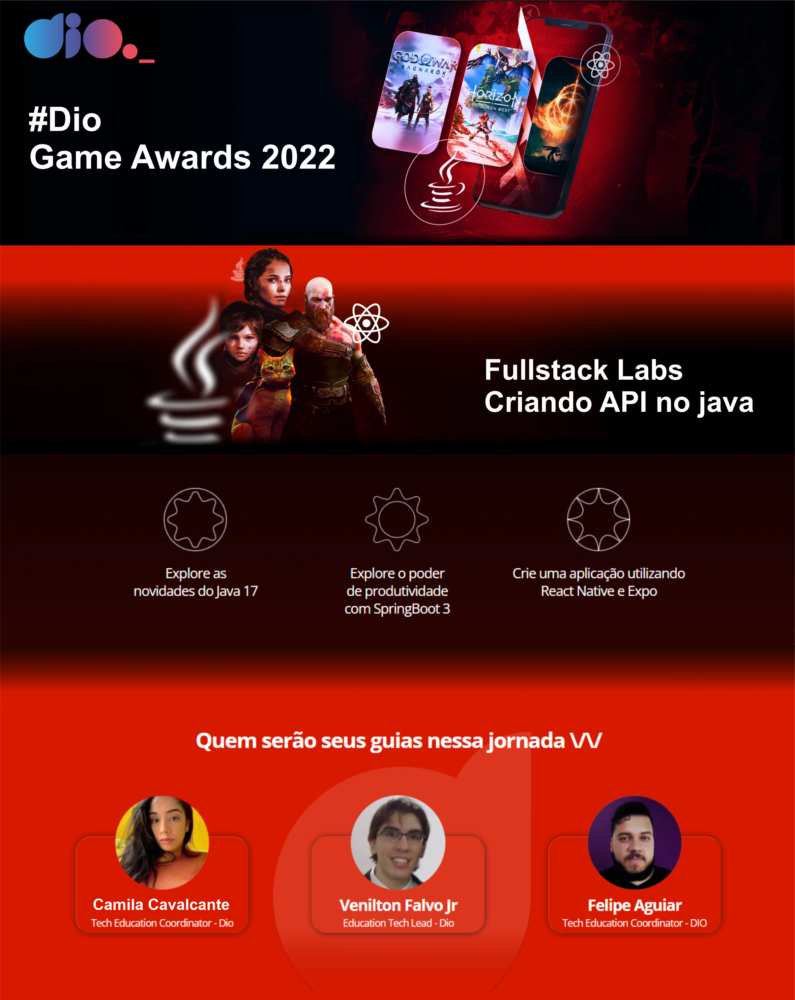

 

# DIO FULLSTACK LABS
# Template Usando Spring Boot Para Criação de APIs REST
  * [Indice](#funciona)
    * [Snippets](https://gist.github.com/falvojr/04b33012a0f59e47d86a9aa0f347cbd2)
    * [🔙 Voltar para Dio - Principal](https://github.com/RickHardBR/DIO)
  

Projeto base (template) usando Java 17 e Spring Boot 3 com Spring Data para Criação de APIs RESTful usando JPA (H2 configurado por padrão). 
Vamos criar uma aplicação baseada na votação do The Game Awards, o evento que escolhe o melhor Jogo do Ano, aprenda como criar o back-end do zero utilizando o Java 17 e SpringBoot 3, além disso vamos consumir essa API em uma aplicação desenvolvida com React Native e Expo com as técnicas e práticas mais atuais de mercado.

## Link da aplicação: <a href="">Dio Game Awards</a>

## 💛 Contato

## 📧rickhhard@gmail.com

## 📧rickhard@bol.com.br

<h4 align="right"><a href="#topo">Topo</a></h4>
